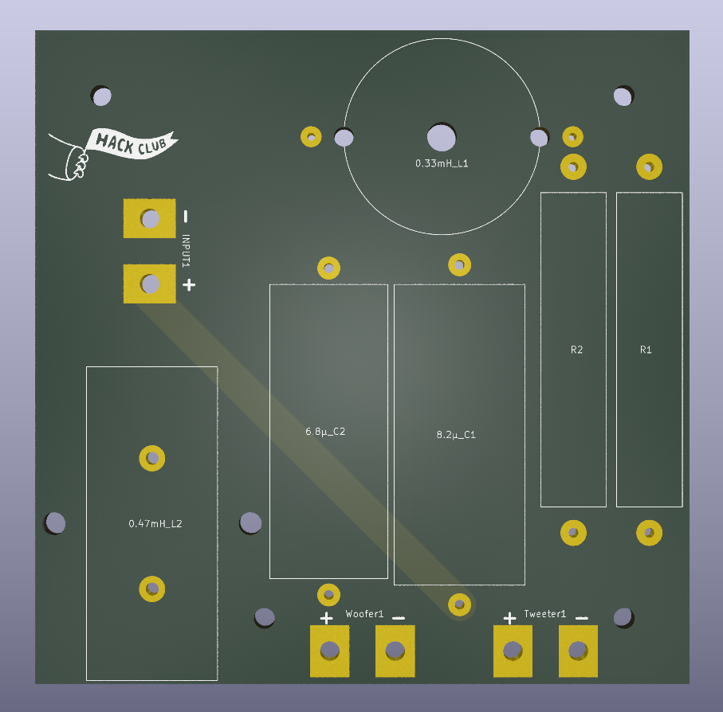
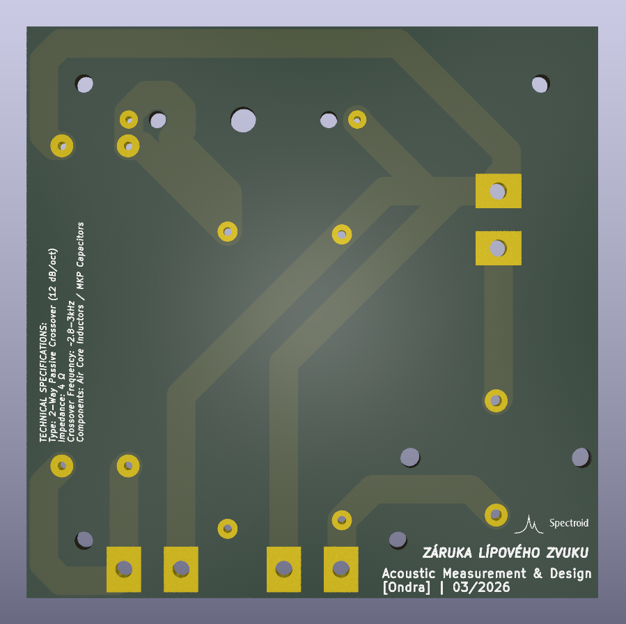
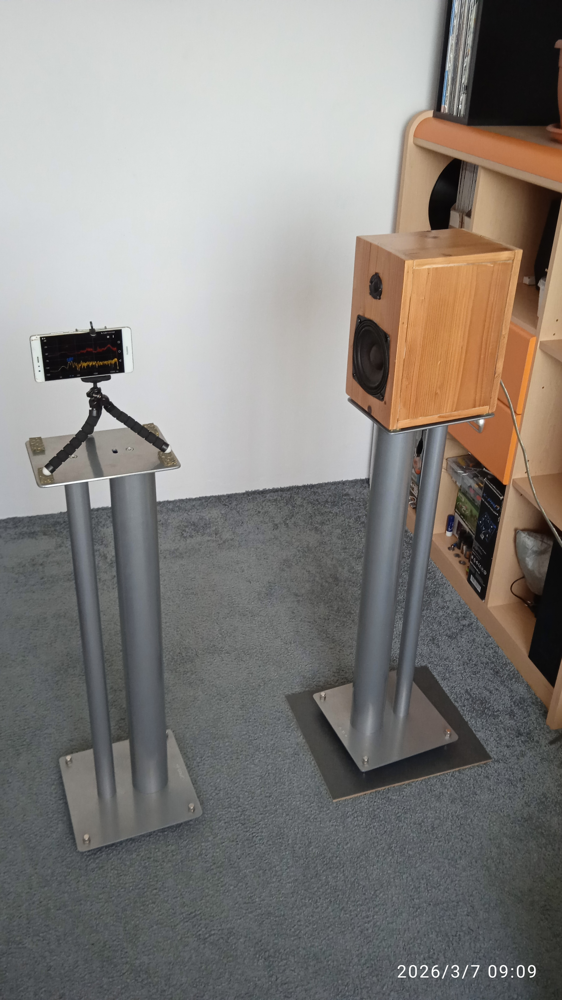

# Description
This is an audio crossover. Its function is to take an audio signal and split it into multiple speakers based on specific frequencies. It is used in speaker cabinets and sound systems to achieve the correct sound.

# How to use
The usage is quite simple: just assemble the PCB, solder the cables from the amplifier to the input, and connect the mid-bass speaker to the "woofer" output and the tweeter to the "tweeter" output.

 

# Why I made this
I created this project because I built speaker cabinets using car speakers and wired them the same way they were in the car. At frequencies around 2-10kHz, both speakers played simultaneously due to the missing 2nd-
order crossover, and the sound was sharp and aggressive. I designed this 2nd-order crossover to audibly eliminate this problem and improve the overall sound quality.

 

# Firmware & Software
This project is a passive analog audio crossover. It uses only discrete components, including capacitors, inductors, and resistors for frequency filtering. There are no microcontrollers or integrated circuits involved, so no firmware is required for this project to operate.

BOM
### Bill of Materials

| Part | Value | Quantity | Price (CZK) | Link |
| :--- | :--- | :--- | :--- | :--- |
| Connecting cables | | 6 | 0 - I have them | - |
| Mounting screws | M3 | 8 | 0 - I have them | - |
| Air coil L1 | 0.33mH | 2 | 260 | [Link](https://www.reproobchod.cz/dexon-vzduchova-civka-0-33mh-0-8mm/) |
| Air coil L2 | 0.47mH | 2 | 338 | [Link](https://www.reproobchod.cz/monacor-lsip-47-2-vzduchova-civka-0-47mh-0-85mm/) |
| Capacitor C1 | 8.2uF | 2 | 192 | [Link](https://www.reproobchod.cz/kondenzator-monacor-mkpa-82-8-2uf-250v-dc-mkp/) |
| Capacitor C2 | 6.8uF | 2 | 190 | [Link](https://www.reproobchod.cz/kondenzator-monacor-mkpa-68-6-8uf-250v-dc-mkp/) |
| Resistor R1 | 1 Ohm | 2 | 60 | [Link](https://www.reproobchod.cz/rezistor-keramicky-visaton-r-1ohm-10-w/) |
| Resistor R2 | 1.5 Ohm | 2 | 60 | [Link](https://www.reproobchod.cz/rezistor-keramicky-visaton-r-1-5ohm-10-w/) |
| Resistor R3 | 2.2 Ohm | 2 | 36 | [Link](https://www.reproobchod.cz/rezistor-keramicky-dratovy-tesla-tr271-2r2-10w/) |
| Resistor R4 | 3 Ohm | 2 | 36 | [Link](https://www.reproobchod.cz/rezistor-keramicky-dratovy-tesla-tr271-3r0-10w/) |
| Shipping | reproobchod.cz | 1 | 69 | - |
| PCB | JLCPCB | 2 | ~90 | [Link](https://jlcpcb.com/) |
| **Total to pay** | | | **1331 CZK** | **~$64.03 USD** |

## Note:
## The real value in dollars is here in the BOM. It is also in the blueprint project, but it differs due to different exchange rates
The 3D component models used in the CAD assembly and STEP file are **representative placeholders**.

I selected these models based on their physical dimensions (length and width) to verify component clearance and PCB seating. The actual high-quality audio components (inductors and capacitors) used for assembly are precisely specified in the **Bill of Materials**.
